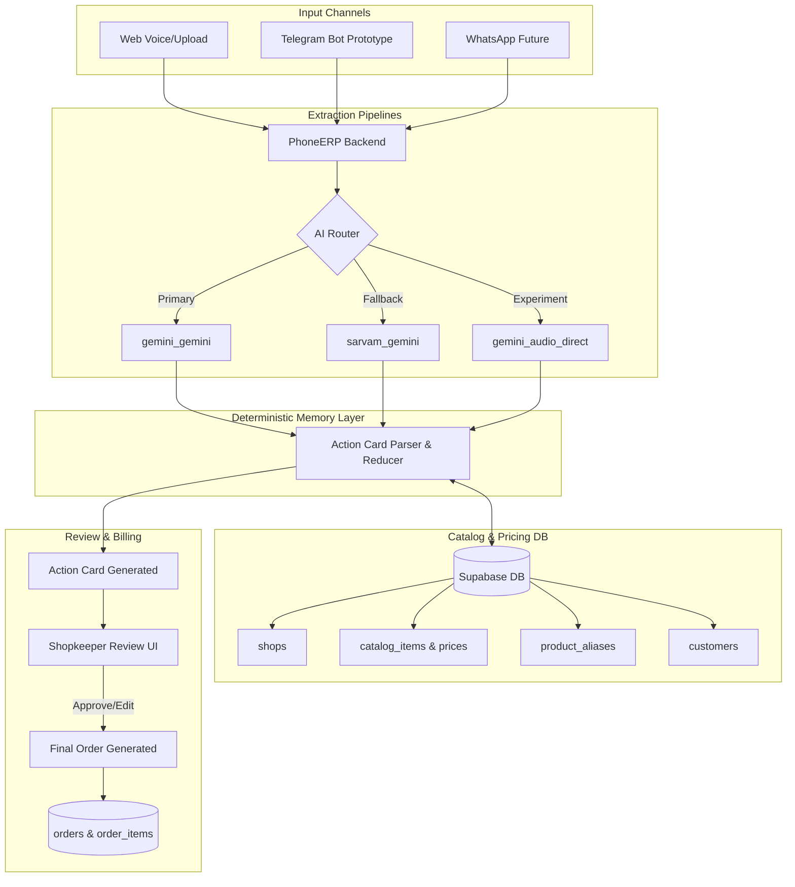

# PhoneERP End-to-End Product Architecture

## 1. Product Goal
PhoneERP is an Indian grocery/kirana/wholesale voice-to-order system. The goal of this product is to provide an end-to-end flow where a customer's voice or text order is processed through AI extraction to generate an Action Card. This card matches items against a shopkeeper's catalog deterministically, fetches correct prices, allows for human review, and culminates in a final order/bill.

## 2. End-to-End Workflow
1. **Input Order**: Customer sends voice or text via Web, Telegram (prototype), or WhatsApp (future).
2. **Extraction**: AI pipeline extracts products, quantities, and operational intents (ADD, CANCEL, etc.).
3. **Action Card Creation**: Deterministic Memory Layer parses AI output, applies operations, and aggregates into an Action Card.
4. **Catalog Match & Pricing**: Products are matched deterministically to the shopkeeper's catalog. Prices are strictly fetched from the database, never guessed by AI.
5. **Shopkeeper Review**: Shopkeeper reviews the Action Card in the UI, resolving missing fields, unclear quantities, or unknown products.
6. **Final Order/Bill**: Approved Action Card is converted into a finalized Order/Bill.

## 3. Architecture Diagram

## 4. Pipeline Options
We retain all existing pipelines:
- **gemini_gemini**: Simple, default primary pipeline.
- **sarvam_gemini**: Hindi-first fallback and benchmark.
- **gemini_audio_direct**: Future experiment.

## 5. Catalog & Pricing Design
The data model ensures strict separation between AI extraction and pricing:
- `shops`: Represents individual businesses.
- `customers`: Associated with specific shops.
- `catalog_items`: Products scoped to a `shop_id`, containing `base_price`, `unit`, etc.
- `product_aliases`: Link alternative names to `catalog_items` (scoped by shop).

**Pricing Rule**: AI only extracts product names and quantities. The Deterministic Layer matches the `raw_name` to `catalog_items` using `product_aliases` and fuzzy matching. The price is strictly sourced from `catalog_items.base_price`. If uncertain, the Action Card item is marked `price_status: "Pending Price Verification"`.

### Supabase Row Level Security (RLS)

RLS is enabled to ensure data privacy and multi-tenant isolation.
- **shops**: Users can only insert/select/update their own shop `(owner_id = auth.uid())`.
- **customers**: Bound to a shop. Users can manage customers of their own shops.
- **catalog_items**: Users can only read and manage items for their own shops. Pricing and availability rules apply per shop.
- **product_aliases**: Bound to a shop for custom/local name resolutions.
- **orders**: Converted from Action Cards, bound to `shop_id`.
- **order_items**: Bound to orders.

## Core Services

### 1. Catalog Service
- Exposes CRUD operations for `catalog_items`.
- Enforces RLS to ensure operations are constrained to the user's `shop_id`.

### 2. Catalog Matching Service
- Maps raw voice/text queries (`raw_name`) deterministically to `catalog_item_id`.
- Uses aliases, fuzzy matching, and exact matches.
- Returns `unit_price` from the database directly, ensuring the AI never hallucinates pricing.

### 3. Order Service
- Converts an Action Card into an `Order` and `OrderItem` records.
- Flags the order with `Pending Price Verification` if the items matched have no configured price or couldn't be matched exactly.

---

## Technical Constraints & Design Principles
1. **AI as Extractor, not Decider:** The LLM is restricted strictly to structuring unstructured text. It handles names, quantities, and addresses.
2. **Pricing is Sacred:** AI MUST NOT guess or calculate pricing. Price lookups happen against `catalog_items` in PostgreSQL.
3. **No Drop / Destructive Migrations:** All schema changes must be non-destructive (`ADD COLUMN IF NOT EXISTS`).

---

## Roadmap

### Phase 1: MVP Vertical Slice (Completed)
- RLS implementation for shops, customers, catalogs, and orders.
- Basic API structure for creating action cards and confirming them into actual orders.
- Deterministic catalog matching pipeline.
- Next.js UI integration for Catalog Management and Orders overview.

### Phase 2: Refinements
- **Telegram Integration:** Add live webhook handling for incoming Telegram voice notes.
- **Advanced Inventory Logic:** Automatic decrement of `in_stock` based on confirmed orders.
- **Mobile PWA:** Enhance the Next.js frontend to be fully installable as a Progressive Web App on shopkeepers' phones.

### Phase 3: Analytics & Sync
- **Accounting Sync:** Webhooks to push generated Orders directly into Tally ERP / Zoho Books.
- **AI Purchase Predictions:** Suggesting restocks to shopkeepers based on order history velocities.

## 6. Action Card Lifecycle
- **Pending**: AI has extracted the card, but it awaits shopkeeper review. Contains `raw_name`, `suggested_catalog_product`, `quantity`, `unit`, `line_total`, `warnings`, `missing_fields`, `metadata`.
- **Approved**: Shopkeeper has reviewed, fixed warnings, and confirmed the card.
- **Converted**: Card is converted to an immutable `Order/Bill`.

## 7. Order/Bill Lifecycle
Once an Action Card is approved, a new record in `orders` is created along with `order_items`. 
- Order totals are calculated deterministically on the backend.
- Modifying an order requires a new Action Card operation (e.g., `RETURN`, `CANCEL`).

## 8. Data Model Migrations
- `001_voice_recordings.sql`: Retained for privacy and consent tracking.
- `002_shops_and_customers.sql`: Introduces `shops` and `customers`.
- `003_catalog_and_orders.sql`: Upgrades `products` to `catalog_items` (linked to `shops`), and introduces `orders` and `order_items`.
- `action_cards` updated to link to `shop_id` and `customer_id`.

## 9. Privacy/Consent Model
- Voice recordings are strictly stored only when `consent_for_evaluation` is `true`.
- Row Level Security (RLS) ensures users can only access recordings, catalogs, and orders belonging to their `shop_id`.

## 10. Pilot Success Metrics
- **Extraction Accuracy**: 95%+ exact match on operations (ADD, CANCEL).
- **Pricing Accuracy**: 100% (Pricing must be purely deterministic, no AI hallucinations).
- **Time to Order**: Reduction in time taken from voice submission to final bill generation.
- **Review Touches**: Average number of edits a shopkeeper makes before approval.

## 11. One-Week Execution Plan
1. **Day 1-2**: Establish Data Models (shops, catalogs, orders). Ensure backward compatibility.
2. **Day 3-4**: Upgrade Memory Layer to fetch prices strictly from `catalog_items` based on `shop_id`.
3. **Day 5-6**: Update Action Card UI to support "Review Mode", showing price warnings and possible product matches.
4. **Day 7**: End-to-end testing of the complete flow: Voice -> Action Card -> Review -> Order.

## 12. Future Roadmap
- **WhatsApp Integration**: Roll out a production-ready WhatsApp bot once the core extraction and pricing engine is stable.
- **Telegram Bot Prototype**: Build an internal Telegram bot for team dogfooding.
- **Inventory Management**: Auto-deduct inventory quantities upon Order creation.

## 13. Deployment Steps
Before or immediately after deploying to production (e.g., Render for Backend, Vercel for Frontend), ensure the following steps are executed:

1. **Deploy Code**: Trigger the deployment to your respective hosting providers.
2. **Run SQL Migrations**: Execute the following SQL files manually in your Supabase SQL Editor (in order) to prepare the production schema:
   - `backend/sql/002_shops_and_customers.sql`
   - `backend/sql/003_catalog_and_orders.sql`
   - `backend/sql/004_action_card_updates.sql`
3. **Verify Environment Variables**:
   - `SUPABASE_URL` and `SUPABASE_KEY` must be correctly configured in the backend environment. If they are missing or invalid, the backend will silently degrade to an in-memory **Mock Mode**, causing data to reset on every reboot.
4. **Test Catalog/Order Flow**: 
   - Sign up/Login to the production app.
   - Navigate to **Catalog** and create a test product.
   - Speak/type an order via **Create Order** or the Telegram bot.
   - Verify the Action Card matches the catalog deterministically and calculates the correct price.
   - Approve the card and verify the final `Order` is securely committed to the database.

## 14. Migration Notes for Production Auth
With the enforcement of `REQUIRE_AUTH=true`, all old records (action cards, orders, catalog items) created previously under "demo mode" (where `user_id` or `owner_id` was `NULL`) are intentionally isolated and will **not** appear for authenticated production users.
- **Do not automatically merge** old NULL records into real users unless explicitly requested by the shop owner.
- These records are safe to ignore or manually delete, as they were generated during unauthenticated testing.
- To use the system going forward, simply sign up/login to create a pristine, production-ready, fully isolated shop profile.
